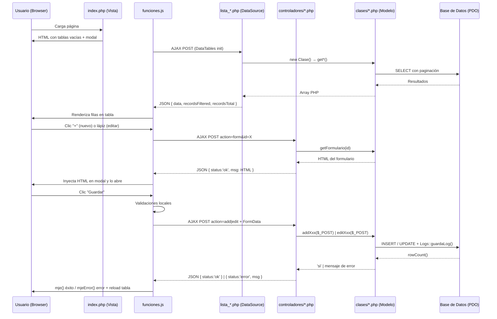

# Análisis de Arquitectura — Módulo `nomina/configuracion`

## Visión General

El sistema usa una arquitectura **MVC personalizada en PHP puro** sin framework externo. La estructura es consistente y sigue patrones claros en todos los sub-módulos.

---

## 1. Estructura de Carpetas

```
src/nomina/
├── certificaciones/
├── configuracion/          ← Sub-módulo analizado
│   ├── js/
│   │   └── funciones.js    ← Lógica JS (DataTables + eventos)
│   └── php/
│       ├── index.php       ← Vista principal (HTML generado en PHP)
│       ├── lista_*.php     ← Endpoints JSON para DataTables (AJAX)
│       ├── clases/         ← Capa de datos (modelo)
│       │   ├── Cargos.php
│       │   ├── Cuentas.php
│       │   ├── Incrementos.php
│       │   ├── Parametros.php
│       │   ├── Rubros.php
│       │   └── Terceros.php
│       └── controladores/  ← Capa de acción (controller)
│           ├── cargos.php
│           ├── cuentas.php
│           ├── incrementos.php
│           ├── parametros.php
│           ├── rubros.php
│           └── terceros.php
├── electronica/
├── empleados/
├── horas_extra/
├── liquidacion/
├── liquidado/
```

---

## 2. Flujo de Datos — Patrón Completo



---

## 3. Capas del Patrón

### 3.1 Vista — `index.php`
- Verifica sesión con `$_SESSION['user']`
- Usa `Plantilla` para renderizar el layout base
- Genera HTML con **Heredoc** (`<<<HTML ... HTML`)
- Aplica lógica condicional según **caracteres de sesión**:
  - `Sesion::Caracter()` → Tipo de usuario (1=público, 2=privado/gobierno)
  - `Sesion::Pto()` → Si tiene presupuesto habilitado
- El HTML muestra u oculta secciones dinámicamente (ej: `$incremento_salarial`, `$presupuesto`)
- Usa un contador automático de viñetas con `preg_replace_callback('/VIÑETA/', ...)`
- Agrega el JS y el modal al final con `$plantilla->addScriptFile()` y `$plantilla->addModal()`

### 3.2 DataSource — `lista_*.php`
Endpoint AJAX puro para DataTables server-side:
```php
$start   = intval($_POST['start']);
$length  = intval($_POST['length']);
$val_busca = $_POST['search']['value'];
$col     = $_POST['order'][0]['column'] + 1;
$dir     = $_POST['order'][0]['dir'];

$sql  = new Clase();
$obj  = $sql->getCosa($start, $length, $val_busca, $col, $dir);
$totalFilter = $sql->getRegistrosFilter($val_busca);
$totalRecords = $sql->getRegistrosTotal();

// Construye array $datos con botones HTML condicionados a permisos
echo json_encode(['data' => $datos, 'recordsFiltered' => ..., 'recordsTotal' => ...]);
```
- Los **botones** de acción (editar/eliminar) se generan en PHP con `Permisos::PermisosUsuario($opciones, $opcion_id, $nivel)`
- Cada registro tiene campos mapeados 1:1 con las columnas del DataTable JS

### 3.3 Controlador — `controladores/*.php`
Switch centralizado de acciones:
```php
$action = $_POST['action']; // form | add | edit | del | annul
switch ($action) {
    case 'form': $res['msg'] = $Clase->getFormulario($id); break;
    case 'add':  $data = $Clase->addXxx($_POST); break;
    case 'edit': $data = $Clase->editXxx($_POST); break;
    case 'del':  $data = $Clase->delXxx($id); break;
}
echo json_encode($res);
```
- Responde siempre en JSON: `{ status: 'ok' }` o `{ status: 'error', msg: '...' }`
- `action='form'` devuelve el HTML del modal en `msg`

### 3.4 Clase/Modelo — `clases/*.php`
Cada clase maneja un recurso y sigue el mismo patrón de métodos:

| Método | Propósito |
|--------|-----------|
| `__construct()` | Obtiene la conexión PDO vía `Conexion::getConexion()` |
| `get*($start, $length, $val_busca, $col, $dir)` | SELECT paginado para DataTables |
| `getRegistrosFilter($val_busca)` | COUNT para `recordsFiltered` |
| `getRegistrosTotal()` | COUNT total para `recordsTotal` |
| `getRegistro($id)` | SELECT por ID (o array vacío si `$id=0`) |
| `getFormulario($id)` | Genera HTML del formulario (llama a `getRegistro()`) |
| `addXxx($array)` | INSERT + `Logs::guardaLog()` |
| `editXxx($array)` | UPDATE + log de auditoría |
| `delXxx($id)` | DELETE + log de auditoría |

---

## 4. Sistema de Sesión y Permisos

### Variables clave de sesión
| Variable | Propósito |
|----------|-----------|
| `Sesion::Caracter()` | Tipo de entidad (1=privada/empresa, 2=pública/gobierno) |
| `Sesion::Pto()` | Módulo presupuesto activo (0=no, 1=sí) |
| `Sesion::IdVigencia()` | Año fiscal activo |
| `Sesion::IdUser()` | ID del usuario logueado |
| `Sesion::Hoy()` | Fecha actual formateada para BD |

### Lógica condicional por `Caracter`
La variable `Sesion::Caracter()` controla qué campos/columnas/secciones se muestran:
- **Caracter = 2**: Muestra campos extra en Cargos (Código, Grado, Perfil SIHO, Nombramiento, Tipo cargo)
- **Caracter = 1 + Pto = 1**: Activa el Centro de Costo en Rubros + tabla Rubros Presupuestales + columna CC en la tabla

### Permisos granulares
```php
$permisos->PermisosUsuario($opciones, $id_opcion, $nivel)
// $nivel: 3=actualizar, 4=eliminar
// $id_opcion: código único por módulo (ej: 5114 = cargos nómina)
```
El rol 1 (admin) siempre tiene acceso sin verificar permisos.

---

## 5. Capa JavaScript (`funciones.js`)

### Inicialización de DataTables
Cada tabla usa una función helper `crearDataTable()`:
```js
crearDataTable(
    '#selector',           // Selector CSS de la tabla
    'lista_xxx.php',       // URL fuente de datos
    [{ data: 'campo' }],   // Definición de columnas
    [{ text, action }],    // Botones de la barra de herramientas
    { pageLength, order, columnDefs },  // Opciones
    function(d) { /* extra params */ }  // Callback datos adicionales
)
```

### Gestión de eventos centralizada
- Cada tabla tiene su `addEventListener('click', ...)` para capturar `.actualizar` y `.eliminar` via **event delegation**
- Un **único listener** en `#modalForms` maneja todos los formularios via `switch(boton.id)`
- Los casos del switch corresponden exactamente a los `id` de los botones del formulario generado en PHP

### Funciones globales usadas
| Función | Descripción |
|---------|-------------|
| `VerFormulario(url, action, id, modal, body, tam, size)` | Hace AJAX GET al controlador y carga el HTML en el modal |
| `Serializa('formId')` | Serializa el formulario a FormData |
| `SendPost(url, data)` | AJAX POST, retorna Promise |
| `EliminaRegistro(url, id, tabla)` | Confirma y elimina, recarga tabla |
| `MuestraError(campo, msg)` / `LimpiaInvalid()` | Validaciones visuales Bootstrap |
| `mje(msg)` / `mjeError(titulo, msg)` | Notificaciones toast |
| `mostrarOverlay()` / `ocultarOverlay()` | Loading spinner |
| `ValueInput(id)` | Obtiene valor de un input por ID |

---

## 6. Infraestructura Base

### Autoloader (PSR-4)
El `autoloader.php` registra múltiples `spl_autoload_register`:
1. **Específico**: `App\DocumentoElectronico\` → `src/contabilidad/soportes/equivalente/...`
2. **Específico**: `Src\Nomina\Electronica\Php\Clases\` → `src/nomina/electronica/php/clases/`
3. **Genérico**: Convierte `Namespace\Sub\Clase` → `namespace/sub/Clase.php` (case-sensitive en el nombre de clase)

### Clase `Plantilla`
- Recibe el contenido HTML y el tipo de plantilla (2 = con sidebar nómina)
- Agrega scripts JS dinámicamente con `addScriptFile(url)`
- Genera el modal Bootstrap con `getModal()` y `addModal()`
- Renderiza todo el layout con `render()`

### Clase `Logs`
- `Logs::guardaLog($sql_string)` guarda un log de auditoría de cada operación SQL exitosa
- Se llama **después** de confirmar `rowCount() > 0` o `lastInsertId() > 0`

---

## 7. Convenciones de Nombres

| Elemento | Convención | Ejemplo |
|----------|------------|---------|
| Tablas HTML | `table` + Nombre + Módulo | `tableCargosNom` |
| Cuerpos de tabla | `modifica` + Nombre | `modificaCargoNom` |
| Botones guardar | `btnGuarda` + Recurso | `btnGuardaCargo` |
| Formularios | `formGest` + Recurso + Módulo | `formGestCargoNom` |
| Inputs hidden ID | `id` (siempre) | `<input id="id" name="id">` |
| Variables JS de sesión | `op` + Nombre + `JS` | `opCaracterJS`, `opPtoJS` |

---

## 8. Tablas de BD Involucradas (configuracion)

| Tabla | Descripción |
|-------|-------------|
| `nom_cargo_empleado` | Cargos de nómina |
| `nom_cargo_codigo` | Códigos de cargo (solo Caracter=2) |
| `nom_cargo_nombramiento` | Tipos de nombramiento |
| `nom_parametros_liq` | Parámetros de liquidación |
| `nom_rel_rubro` | Relación rubros presupuestales |
| `nom_tipo_rubro` | Tipos de rubro |
| `pto_cargue` | Rubros presupuestales (admin/operativo) |
| `tb_centrocostos` | Centros de costo |
| `nom_causacion` | Cuentas contables |
| `nom_terceros_nom` | Terceros (EPS/AFP/ARL/etc.) |
| `nom_incremento_sal` | Incrementos salariales |

